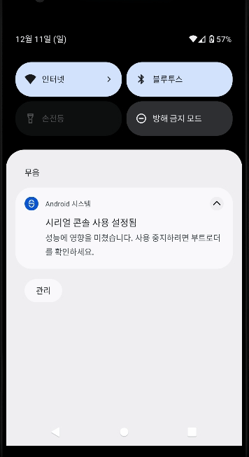

- 레트로핏 2.x 에서 응답을 String으로 받아오기
    - 참고 : https://onlyfor-me-blog.tistory.com/179

### 2022년 11월 27일 중간 완성
#### 완성된 기능
- 웹에서 새로운 userid 를 받아와서 SQLite에 저장. (CREATE)
- 웹에서 keyword List를 받아옴 (READ)
- 웹 DB에 키워드를 추가 (CREATE)
- 웹 DB에 키워드 삭제 (DELETE)
- 내부 SQLite 테이블 초기화

#### (서버 로직 미완성)
- Job 스케줄러로 웹에 키워드 알람 Request 요청 보내기
- 위의 요청을 받고 응답을 알람을 띄어줌
- 

#### 안드로이드 특정 주기로 계속 동작 방법
- url : https://wfreud.tistory.com/378
- AlarmManager, JobScheduler, workmanager 3가지가 존재
- JobScheduler, workmanager 는 최소 단위가 15분.
- AlarmManager 는 30초 단위의 동작이 가능하나 대기화면에서 5분에 한번 동작하는 문제가 있음.
- 해결책 : https://wooyeol.github.io/2019/03/19/Android-Repeat-Background-Service/
- https://www.youtube.com/watch?v=3G8Grx9zkCo