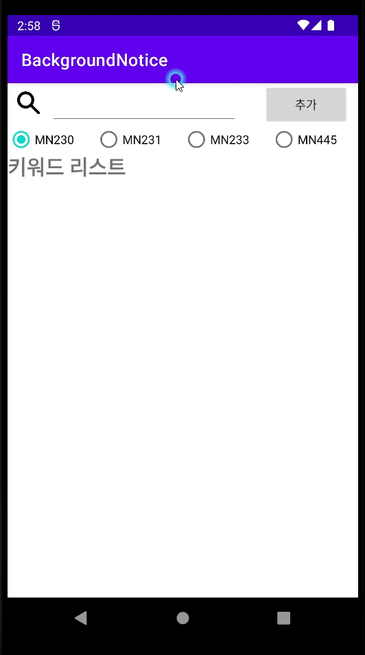
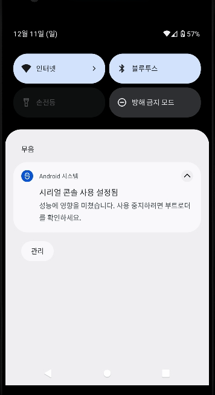

- 레트로핏 2.x 에서 응답을 String으로 받아오기
    - 참고 : https://onlyfor-me-blog.tistory.com/179

### 2022년 11월 27일 중간 완성
#### 완성된 기능
- 웹에서 새로운 userid 를 받아와서 SQLite에 저장. (CREATE)
- 웹에서 keyword List를 받아옴 (READ)
- 웹 DB에 키워드를 추가 (CREATE)
- 웹 DB에 키워드 삭제 (DELETE)
- 내부 SQLite 테이블 초기화

#### (서버 로직 미완성)
- Job 스케줄러로 웹에 키워드 알람 Request 요청 보내기
- 위의 요청을 받고 응답을 알람을 띄어줌

#### 안드로이드 특정 주기로 계속 동작 방법
- url : https://wfreud.tistory.com/378
- AlarmManager, JobScheduler, workmanager 3가지가 존재
- JobScheduler, workmanager 는 최소 단위가 15분.
- AlarmManager 는 30초 단위의 동작이 가능하나 대기화면에서 5분에 한번 동작하는 문제가 있음.
- 해결책 : https://wooyeol.github.io/2019/03/19/Android-Repeat-Background-Service/
- 참고 영상 (알림과 스케줄러) : https://www.youtube.com/watch?v=3G8Grx9zkCo

### 안드로이드-서버 통신 로직

1. 사용자가 처음 어플을 동작시킬 때 서버로부터 USERID를 할당받아 DB에 저장한다.
2. 키워드 추가/삭제시 DB의 userid로 사용자를 식별에 서버 DB에 저장한다.
3. 백그라운드 상태에서 Job 스케줄러가 15분 단위로 서버에 userid를 담아 GET 요청을 보낸다.
   서버는 새로운 게시글의 대한 데이터를 json 형태로 클라이언트에 응답한다.

### 솔직하게 아쉬운점.
1. 버그가 굉장히 많습니다.  
   백엔드 지식에 대한 굉장히 많은 지식이 부족한 것을 깨달았습니다.  
   앞으로 백엔드 프로그래머 개발자로 성장하겠지만,  
   이런식의 버그가 많다는 것은 굉장히 치명적입니다.  
   처음부터 로직 하나하나에 방어적 프로그래밍을 했다면 어땠을까 했지만...  
   사실 지금은 기능 위주로 빠르게 개발하는게 주요한 목표였던지라  
   아쉬움은 아쉬움으로 남길려고 합니다.  
2. 키워드 알람 로직이 정말 개판입니다.  
   굳이 백엔드 개발을 하고 싶어서 어플에서 크롤링을 하면을 될 것을  
   굳이굳이 서버 로직까지 만들다보니 너무 복잡해지고 시간만 많이걸리게 되었습니다.  

